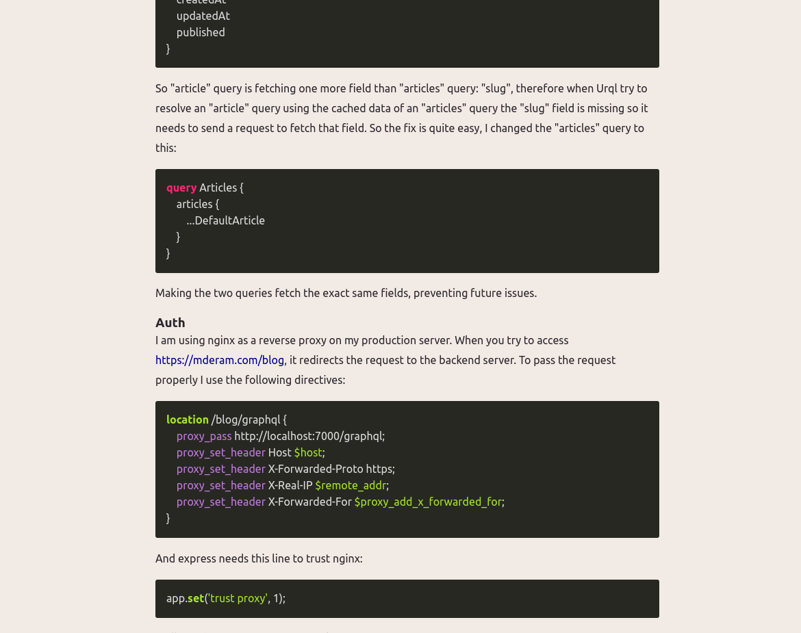

# blog-frontend
Blog frontend built with ReactJs, NextJs and Sass.

[](https://sonarcloud.io/summary/new_code?id=mDeram_blog-frontend)
[](https://sonarcloud.io/summary/new_code?id=mDeram_blog-frontend)
[](https://sonarcloud.io/summary/new_code?id=mDeram_blog-frontend)

## Running the project in development
It runs on port 6000 by default, some browser block that port, you can change it in package.json
```sh
npm run dev
```
Then you can visit the following urls:
- localhost:6000/blog to visit the blog index (you can change the base path in next.config.js)
- localhost:6000/blog/editor to access the editor (you need to be logged in)
- localhost:6000/blog/editor/login to log in (you need to create an account using the backend)

## Running the project in production
It runs on port 6000 by default, some browser block that port, you can change it in package.json
```sh
npm run build
npm run start
```

## Generate the graphql schemas
When you change some graphql schemas in the backend, you need to generate up-to-date schemas for the frontend using:
```sh
npm run gen
```

## Environment variables
### Private
It is used by the Incremental Static Regeneration endpoint for on-demand revalidation. ([What is ISR?](https://nextjs.org/docs/basic-features/data-fetching/incremental-static-regeneration))

`REVALIDATE_TOKEN=some_random_string`

Your graphql endpoint url used by the NextJs server (to build pages)
Note that this can be equal to the NEXT_PUBLIC_GRAPHQL_ENDPOINT

`GRAPHQL_ENDPOINT="http://localhost:7000/graphql`

### Public
Your graphql endpoint url used by the client

`NEXT_PUBLIC_GRAPHQL_ENDPOINT="https://example.com/graphql"`

## Customizing colors
1. Add a scss file in src/styles/colorscheme/your_colors.scss directory.
2. Change src/styles/colorscheme.scss content to: @forward 'colorscheme/your_colors';

- $color-a // Primary
- $color-c // Only used in the editor you can use the same color as $color-d
- $color-d // Accent
- $color-error // Error
- $color-warning // Not used yet
- $color-success // Success

## Previews
### Index


### An article


### Editor index


### Editor


### Login (2FA using TOTP)

